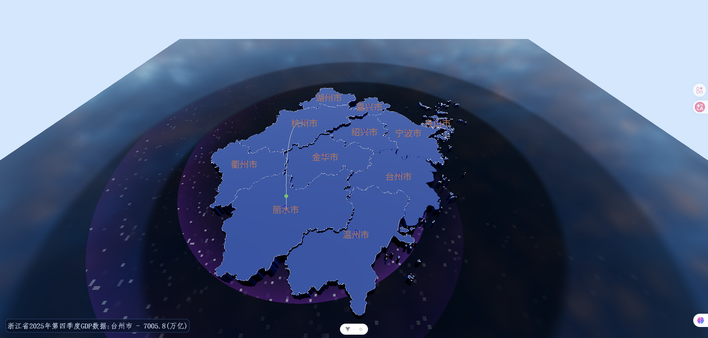

# 3dMap-vue

A 3D map visualization project of Zhejiang Province built with Vue 3 and Three.js.

This project is an imitation/reproduction practice based on [`3d-geoMap`](https://github.com/xiaogua-bushigua/3d-geoMap), with additional refactoring and feature extensions.

## Preview




## Features

- 3D extruded map of Zhejiang Province
- GeoJSON parsing and projection conversion (Mercator via d3)
- Region click interaction and information panel
- Radar scanning background effect
- Fly line animation
- Matcap side material for enhanced visual style
- Loading progress feedback

## Tech Stack

- Vite
- Vue 3
- JavaScript
- Three.js
- d3.js (Mercator projection)
- GeoJSON processing (Ali geographic tooling / district data workflow)

## Getting Started

### Prerequisites

- Node.js 18+ (recommended)
- npm 9+ (or compatible package manager)

### Install

```bash
npm install
```

### Run Development Server

```bash
npm run dev
```

### Build for Production

```bash
npm run build
```

### Lint

```bash
npm run lint
```

## Project Structure

```text
src/
  core/           # three engine, map modules, resource manager
  views/          # page-level vue files
  components/     # reusable vue components
  config/         # map and visual configs
  utils/          # loaders and helpers
public/data/      # JSON/HDR/texture assets
```

## Roadmap

- [x] Radar scanning background
- [x] Replace grid with sci-fi style floor
- [x] HDR loading flow optimization
- [x] Project structure refactor
- [x] Loading progress bar
- [x] Abstract utilities and constants
- [x] Performance optimization
- [x] Matcap side material
- [x] Interactive info popup
- [x] Fly line effect

## Acknowledgements

- Original inspiration: [`xiaogua-bushigua/3d-geoMap`](https://github.com/xiaogua-bushigua/3d-geoMap)
