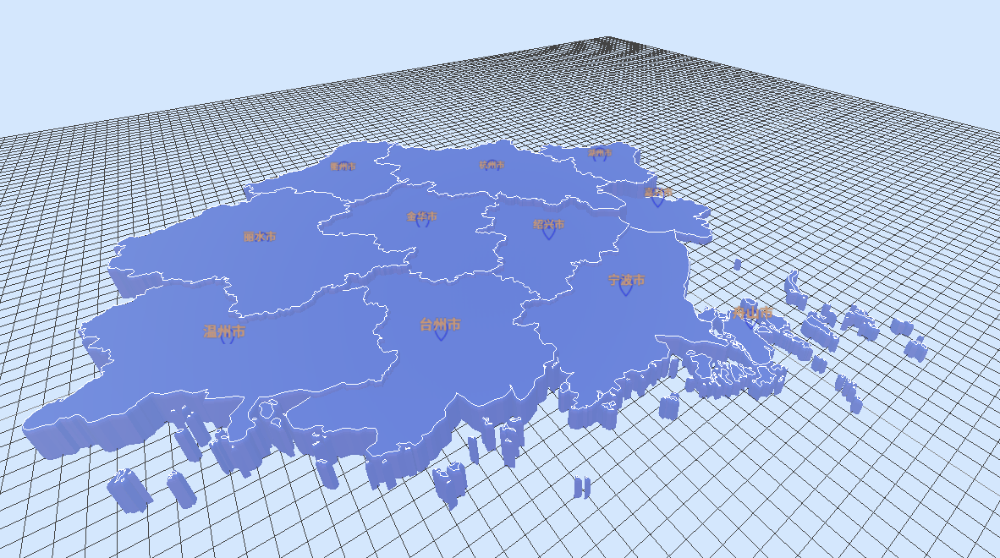

# **3dMap-vue**

## **Description**

This is a project named "3dMap-vue" on GitHub. The demo displays a 3D map of Zhejiang Province, built with Three.js and Vue3. It is an imitation of a project called "3dgeoMap" on GitHub, and the link is attached below.



## Tech Stack


- Vite
- Vue3
- Javascript
- d3.js - 墨卡托投影
- GeoJson处理(阿里地理工具)
- three.js

## Usage

First,

```cmd 
npm install
```

Second

```cmd
npm run dev
```


## **Information**

3d-geoMap:https://github.com/xiaogua-bushigua/3d-geoMap
