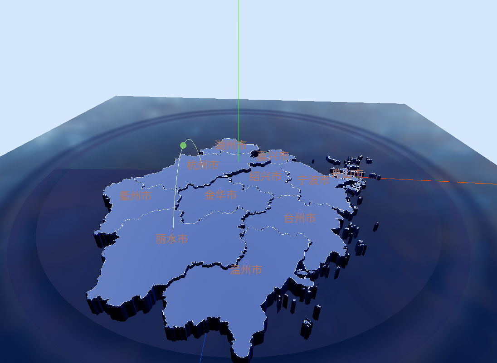

# **3dMap-vue**

## **Description**

This is a project named "3dMap-vue" on GitHub. The demo displays a 3D map of Zhejiang Province, built with Three.js and Vue3. It is an imitation of a project called "3dgeoMap" on GitHub, and the link is attached below.

、

## Tech Stack

- Vite
- Vue3
- Javascript
- d3.js - 墨卡托投影
- GeoJson处理(阿里地理工具)
- three.js

## Usage

First,

```cmd 
npm install
```

Second，

```cmd
npm run dev
```


## future


- [x] 雷达探测背景图
- [x] 替换网格为镂空科技感非透明背景图
- [x] hdr加载问题
- [ ] 项目结构问题
- [x] loading进度条
- [ ] 封装抽象函数和变量
- [ ] 优化性能
- [x] 增加matcap材质侧面材质
- [x] 交互显示弹出功能
- [x] 飞线


## **Information**

3d-geoMap:https://github.com/xiaogua-bushigua/3d-geoMap
